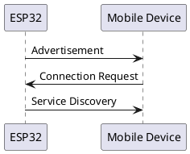
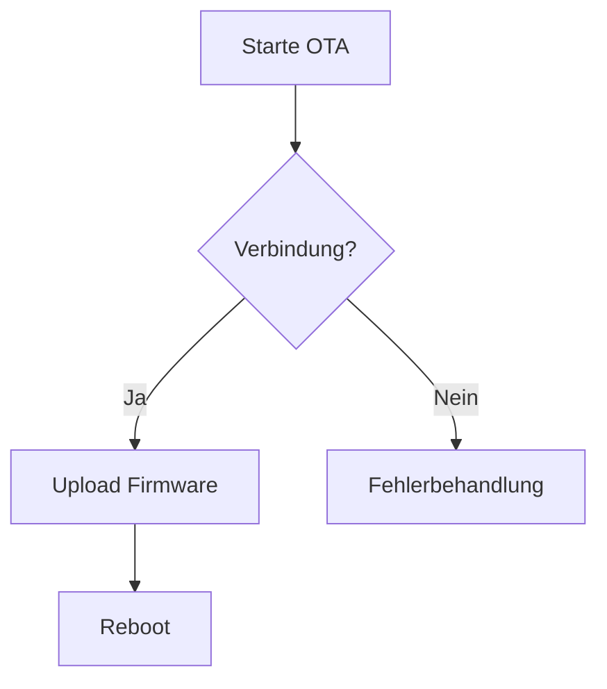

This file is a merged representation of the entire codebase, combined into a single document by Repomix.
The content has been processed where empty lines have been removed, content has been formatted for parsing in markdown style, security check has been disabled.

# File Summary

## Purpose
This file contains a packed representation of the entire repository's contents.
It is designed to be easily consumable by AI systems for analysis, code review,
or other automated processes.

## File Format
The content is organized as follows:
1. This summary section
2. Repository information
3. Directory structure
4. Multiple file entries, each consisting of:
  a. A header with the file path (## File: path/to/file)
  b. The full contents of the file in a code block

## Usage Guidelines
- This file should be treated as read-only. Any changes should be made to the
  original repository files, not this packed version.
- When processing this file, use the file path to distinguish
  between different files in the repository.
- Be aware that this file may contain sensitive information. Handle it with
  the same level of security as you would the original repository.

## Notes
- Some files may have been excluded based on .gitignore rules and Repomix's configuration
- Binary files are not included in this packed representation. Please refer to the Repository Structure section for a complete list of file paths, including binary files
- Files matching patterns in .gitignore are excluded
- Files matching default ignore patterns are excluded
- Empty lines have been removed from all files
- Content has been formatted for parsing in markdown style
- Security check has been disabled - content may contain sensitive information
- Files are sorted by Git change count (files with more changes are at the bottom)

## Additional Info

# Directory Structure
```
JRDev_uCore/
  docs/
    API.md
    EXAMPLES.md
    TROUBLESHOOTING.md
    TUTORISLS.md
  examples/
    AdvancedFeatures/
      AdvancedFeatures.ino
      uConfig.h
    BasicUsage/
      BasicUsage.ino
      uConfig.h
    FullSystemDemo/
      FullSystemDemo.ino
      uConfig.h
  src/
    communication/
      I2Cmanager.cpp
      I2Cmanager.h
      SPIManager.cpp
      SPIManager.h
      UARTManager.cpp
      UARTManager.h
      USBManager.cpp
      USBManager.h
    config/
      uConfigAdvanced.h
      uConfigDef.h
      uConfigDefault.h
      uConfigSimple.h
    core/
      uCore.cpp
      uCore.h
    network/
      BLEManager.cpp
      BLEManager.h
      MQTTManager.cpp
      MQTTManager.h
      WIFIManager.cpp
      WIFIManager.h
    system/
      PowerManager.cpp
      PowerManager.h
      SystemManager.cpp
      SystemManager.h
      TaskManager.cpp
      TaskManager.h
    utilities/
      ConfigManager.cpp
      ConfigManager.h
      FileSystem.cpp
      FileSystem.h
      OLEDDriver.cpp
      OLEDDriver.h
      OTAUpdate.cpp
      OTAUpdate.h
      WEBSerial.cpp
      WEBSerial.h
    JRuCore.h
  tests/
    test_wifi_manager.cpp
  CHANGELOG.md
  config.h
  keywords.txt
  library-structure.txt
  library.properties
  platformio.ini
  README.md
```

# Files

## File: JRDev_uCore/docs/API.md
````markdown
# JRDevECore Library API Reference

## Core System
### Klasse `CoreSystem`
```cpp
namespace JRDevECore {
  class CoreSystem {
    public:
      void begin(); // Initialisiert Hardware und Watchdog
      void setCPUFrequency(uint32_t frequency); // 80, 160 oder 240 MHz
      String getChipID(); // Gibt eindeutige Chip-ID zurück
  };
}
```

**Beispiel:**
```cpp
JRDevECore::CoreSystem core;
core.begin();
core.setCPUFrequency(240); // Maximale Leistung
Serial.println("Chip ID: " + core.getChipID());
```

## WiFi Management
### Klasse `WiFiController`


```cpp
enum class ConnectionMode { STA, AP, STA_AP };

void configure(ConnectionMode mode, NetworkConfig config);
void start(); // Startet konfigurierte Verbindung
```

**Netzwerkkonfiguration:**
```cpp
JRDevECore::WiFiController::NetworkConfig cfg {
  .ssid = "MeinNetzwerk",
  .password = "geheim",
  .staticIP = IPAddress(192,168,1,100),
  .gateway = IPAddress(192,168,1,1),
  .subnet = IPAddress(255,255,255,0)
};
```

## BLE-Kommunikation


**GATT-Service Erstellung:**
```cpp
BLEController ble("MyDevice");
ble.addService({
  .serviceUUID = "0000ffe0-0000-1000-8000-00805f9b34fb",
  .characteristicUUID = "0000ffe1-0000-1000-8000-00805f9b34fb",
  .notify = true
});
```

[Vollständige API-Liste](API_FULL.md)
````

## File: JRDev_uCore/docs/EXAMPLES.md
````markdown
# Beispielanwendungen

## 1. Umweltmonitor
**Schaltung:**


**Codeausschnitt:**
```cpp
JRDevECore::I2CController i2c;
JRDevECore::MQTTController mqtt;

void readSensor() {
  float temp = i2c.readRegister(BME680_ADDR, TEMP_REG);
  mqtt.publish("sensor/temp", String(temp));
}
```

## 2. Smart Home Controller
**Systemarchitektur:**
```plaintext
ESP32 <--BLE--> Smartphone
  |
  +--WiFi--> MQTT Broker
  |
  +--GPIO--> Relais
```

**Entscheidungstabelle:**
| Befehl    | Aktion           | GPIO | MQTT Topic       |
|-----------|------------------|------|------------------|
| LIGHT_ON  | Schaltet Relais  | 23   | home/living/light|
| HEAT_OFF  | Heizung ausschalten | 18 | home/heating     |
````

## File: JRDev_uCore/docs/TROUBLESHOOTING.md
````markdown
# Problembehandlung
```markdown
# Häufige Probleme & Lösungen

## WiFi-Verbindungsprobleme
**Symptom:**  
`E (12345) wifi: wifi connect failed`

**Lösungsweg:**
1. SSID/Passwort in uConfig.h prüfen
2. WiFi-Modus (STA/AP) bestätigen
3. Frequenzbereich anpassen:
```cpp
wifi.setChannel(6); // 2.4GHz Kanal 6
```

## Dateisystem-Fehler
**Fehlermeldung:**  
`Failed to mount filesystem`

**Schritte zur Behebung:**
1. Dateisystem formatieren:
```cpp
JRDevECore::FileSystem fs;
fs.begin(true); // Erzwingt Formatierung
```
2. Flash-Speicher überprüfen:
```cpp
Serial.printf("Flash Size: %d MB\n", ESP.getFlashChipSize() / (1024 * 1024));
```

## MQTT-Verbindungsabbruch
**Typische Ursachen:**
- Falsche Portkonfiguration
- Zertifikatsprobleme
- Keep-Alive Timeout

**Debugging:**
```cpp
mqtt.setConnectionCallback([](bool connected) {
  Serial.println(connected ? "Verbunden" : "Getrennt");
});
```

[Fehlercodes Referenz](ERROR_CODES.md)
```
````

## File: JRDev_uCore/docs/TUTORISLS.md
````markdown
# Tutorials

## 1. Erste Schritte
### Hardwarevorbereitung


**Benötigte Komponenten:**
- ESP32-DevKitC
- USB-Kabel
- LED mit 220Ω Widerstand

### Grundlegende Initialisierung
```cpp
#include <JRDevECore.h>

JRDevECore::CoreSystem core;
JRDevECore::WiFiController wifi;

void setup() {
  core.begin();
  wifi.configure(JRDevECore::WiFiController::STA, {/*...*/});
  wifi.start();
}
```

## 2. OTA-Updates
**Ablaufdiagramm:**


**Implementierung:**
```cpp
OTAHandler ota;
ota.initialize("myDevice", {
  .progressCallback = [](unsigned prog, unsigned total) {
    Serial.printf("Fortschritt: %d%%\n", (prog*100)/total);
  }
});
```

## 3. Low-Power Betrieb
**Energiesparmodi Vergleich:**
| Modus         | Stromverbrauch | Wakeup-Quellen          |
|---------------|----------------|-------------------------|
| Light Sleep   | 0.8 mA         | Timer, GPIO, Netzwerk   |
| Deep Sleep    | 5 μA           | Timer, GPIO             |
| Hibernate     | 2 μA           | GPIO                    |

**Beispielkonfiguration:**
```cpp
power.setSleepMode(PowerController::DeepSleep);
power.enableWakeupTimer(300); // 5 Minuten
```

[Weitere Tutorials](ADVANCED.md)
````

## File: JRDev_uCore/examples/AdvancedFeatures/AdvancedFeatures.ino
````
#include <JRuCore.h>
#include <WiFiManager.h>
#include <OTAUpdate.h>
#include <USBManager.h>

JRuCore::CoreSystem systemCore;
JRuCore::WiFiController wifi;
JRuCore::OTAHandler ota;
JRuCore::USBController usb;

void setup() {
  systemCore.begin();
  
  // WiFi konfigurieren
  JRuCore::WiFiController::NetworkConfig cfg = {
    .ssid = "MeinNetzwerk",
    .password = "geheim",
    .staticIP = IPAddress(192,168,1,100),
    .gateway = IPAddress(192,168,1,1),
    .subnet = IPAddress(255,255,255,0)
  };
  wifi.configure(JRuCore::WiFiController::ConnectionMode::STA, cfg);
  wifi.start();
  
  // OTA Updates
  JRuCore::OTAHandler::OTACallbacks otaCallbacks = {
    []() { Serial.println("OTA Start"); },
    [](unsigned prog, unsigned total) { Serial.printf("Progress: %u%%\n", (prog*100)/total); },
    []() { Serial.println("OTA Fertig"); },
    [](ota_error_t err) { Serial.printf("OTA Fehler: %d\n", err); }
  };
  ota.initialize("esp32-device", otaCallbacks);
  
  // USB initialisieren
  usb.begin(JRuCore::USBController::Mode::Composite);
}

void loop() {
  wifi.handleEvents();
  ota.handle();
  
  // USB-Kommunikation
  static uint8_t buffer[64];
  if(usb.receiveHIDReport(buffer, sizeof(buffer))) {
    // Verarbeite empfangene Daten
    usb.sendHIDReport(buffer, sizeof(buffer));
  }
  
  delay(100);
}
````

## File: JRDev_uCore/examples/AdvancedFeatures/uConfig.h
````
// WiFi-Zugangsdaten
#define WIFI_SSID "MeinNetzwerk"
#define WIFI_PASS "geheim123"

// OTA-Einstellungen
#define OTA_HOSTNAME "esp32-device"
#define OTA_PASSWORD "ota123"

// Systemeinstellungen
#define CPU_FREQUENCY 240
#define WATCHDOG_TIMEOUT 30
````

## File: JRDev_uCore/examples/BasicUsage/BasicUsage.ino
````
#include <JRuCore.h>

JRuCore::CoreSystem systemCore;

void setup() {
  Serial.begin(115200);
  systemCore.begin();
  
  Serial.print("Chip ID: ");
  Serial.println(systemCore.getChipID());
  
  Serial.print("Flash Info: ");
  Serial.println(systemCore.getFlashInfo());
}

void loop() {
  // Einfache Systemüberwachung
  static uint32_t lastPrint = 0;
  if(millis() - lastPrint > 1000) {
    lastPrint = millis();
    Serial.printf("Free Heap: %u bytes\n", ESP.getFreeHeap());
  }
}
````

## File: JRDev_uCore/examples/BasicUsage/uConfig.h
````
// WiFi-Zugangsdaten
#define WIFI_SSID "MeinNetzwerk"
#define WIFI_PASS "geheim123"

// OTA-Einstellungen
#define OTA_HOSTNAME "esp32-device"
#define OTA_PASSWORD "ota123"

// Systemeinstellungen
#define CPU_FREQUENCY 240
#define WATCHDOG_TIMEOUT 30
````

## File: JRDev_uCore/examples/FullSystemDemo/FullSystemDemo.ino
````
#include <JRuCore.h>
#include <WiFiManager.h>
#include <TaskManager.h>
#include <OTAUpdate.h>
#include <FileSystem.h>
#include <USBManager.h>
#include <ConfigManager.h>

// uConfig.h im Sketch-Verzeichnis
#include "uConfig.h"

using namespace JRuCore;

CoreSystem systemCore;
WiFiController wifi;
OTAHandler ota;
FileSystem fs;
USBController usb;
ConfigManager config;

class SystemMonitorTask : public ManagedTask<SystemMonitorTask> {
  public:
    SystemMonitorTask() : ManagedTask("SysMon", 4096, 1) {}
    
    void run() {
      while(true) {
        // Systemüberwachung
        Serial.printf("CPU Temp: %.1f°C\n", temperatureRead());
        vTaskDelay(pdMS_TO_TICKS(5000));
      }
    }
} monitorTask;

void setup() {
  Serial.begin(115200);
  
  // System initialisieren
  systemCore.begin();
  
  // Konfiguration laden
  if(!config.loadFromFile()) {
    Serial.println("Neue Konfiguration erstellt");
    config.setValue("wifi_ssid", WIFI_SSID);
    config.setValue("wifi_pass", WIFI_PASS);
    config.saveToFile();
  }
  
  // WiFi konfigurieren
  WiFiController::NetworkConfig cfg = {
    .ssid = config.getValue("wifi_ssid"),
    .password = config.getValue("wifi_pass"),
    .staticIP = IPAddress(192,168,1,100),
    .gateway = IPAddress(192,168,1,1),
    .subnet = IPAddress(255,255,255,0)
  };
  wifi.configure(WiFiController::ConnectionMode::STA, cfg);
  wifi.start();
  
  // OTA Updates
  OTAHandler::OTACallbacks otaCallbacks = {
    []() { Serial.println("OTA Start"); },
    [](unsigned prog, unsigned total) { Serial.printf("Progress: %u%%\n", (prog*100)/total); },
    []() { Serial.println("OTA Fertig"); },
    [](ota_error_t err) { Serial.printf("OTA Fehler: %d\n", err); }
  };
  ota.initialize("esp32-device", otaCallbacks);
  
  // Dateisystem
  if(!fs.begin()) {
    Serial.println("Formatierung notwendig!");
    fs.format();
  }
  
  // USB initialisieren
  usb.begin(USBController::Mode::Composite);
  
  // Task starten
  monitorTask.start(&monitorTask);
}

void loop() {
  wifi.handleEvents();
  ota.handle();
  
  // USB-Kommunikation
  static uint8_t buffer[64];
  if(usb.receiveHIDReport(buffer, sizeof(buffer))) {
    // Verarbeite empfangene Daten
    usb.sendHIDReport(buffer, sizeof(buffer));
  }
  
  delay(100);
}
````

## File: JRDev_uCore/examples/FullSystemDemo/uConfig.h
````
// Vollständige Konfiguration für Demozwecke
#include "../src/config/uConfigAdvanced.h"

// Gerätespezifische Overrides
#undef NET_WIFI_SSID
#define NET_WIFI_SSID "DemoNet"

#undef PERIPH_NEOPIXEL_COUNT
#define PERIPH_NEOPIXEL_COUNT 16

// Experimentelle Features
#define EXPERIMENTAL_BLE_MESH true
#define EXPERIMENTAL_WEBSERVER true
````

## File: JRDev_uCore/src/communication/I2Cmanager.cpp
````cpp
#include "I2CManager.h"

namespace uCore {
  I2CController::I2CController(int sdaPin, int sclPin, uint32_t frequency)
    : _sdaPin(sdaPin), _sclPin(sclPin), _frequency(frequency) {}

  void I2CController::begin() {
    if(_sdaPin != -1 && _sclPin != -1) {
      Wire.begin(_sdaPin, _sclPin);
    } else {
      Wire.begin();
    }
    Wire.setClock(_frequency);
    _initialized = true;
  }

  void I2CController::scanDevices() {
    _checkInitialization();
    for(uint8_t address = 1; address < 127; address++) {
      Wire.beginTransmission(address);
      if(Wire.endTransmission() == 0) {
        Serial.printf("Device found at 0x%02X\n", address);
      }
    }
  }

  bool I2CController::deviceExists(uint8_t address) {
    _checkInitialization();
    Wire.beginTransmission(address);
    return Wire.endTransmission() == 0;
  }

  bool I2CController::writeByte(uint8_t address, uint8_t reg, uint8_t value) {
    _checkInitialization();
    Wire.beginTransmission(address);
    Wire.write(reg);
    Wire.write(value);
    return Wire.endTransmission() == 0;
  }

  uint8_t I2CController::readByte(uint8_t address, uint8_t reg) {
    _checkInitialization();
    Wire.beginTransmission(address);
    Wire.write(reg);
    Wire.endTransmission(false);
    Wire.requestFrom(address, (uint8_t)1);
    return Wire.read();
  }

  void I2CController::setFrequency(uint32_t frequency) {
    _frequency = frequency;
    if(_initialized) {
      Wire.setClock(_frequency);
    }
  }

  void I2CController::setPins(int sdaPin, int sclPin) {
    _sdaPin = sdaPin;
    _sclPin = sclPin;
    if(_initialized) {
      begin();
    }
  }

  void I2CController::_checkInitialization() {
    if(!_initialized) {
      Serial.println("I2C not initialized!");
      begin();
    }
  }
}
````

## File: JRDev_uCore/src/communication/I2Cmanager.h
````
#pragma once
#include <Wire.h>

namespace uCore {
  class I2CController {
    public:
      I2CController(int sdaPin = -1, int sclPin = -1, uint32_t frequency = 100000);
      
      void begin();
      void scanDevices();
      
      bool deviceExists(uint8_t address);
      bool writeByte(uint8_t address, uint8_t reg, uint8_t value);
      uint8_t readByte(uint8_t address, uint8_t reg);
      
      void setFrequency(uint32_t frequency);
      void setPins(int sdaPin, int sclPin);
      
    private:
      int _sdaPin;
      int _sclPin;
      uint32_t _frequency;
      bool _initialized = false;
      
      void _checkInitialization();
  };
}
````

## File: JRDev_uCore/src/communication/SPIManager.cpp
````cpp
#include "SPIManager.h"

namespace uCore {
  SPIController::SPIController(int misoPin, int mosiPin, int sclkPin, int csPin)
    : _misoPin(misoPin), _mosiPin(mosiPin), _sclkPin(sclkPin), _csPin(csPin) {}

  void SPIController::begin() {
    if(_misoPin != -1 && _mosiPin != -1 && _sclkPin != -1) {
      SPI.begin(_sclkPin, _misoPin, _mosiPin);
    } else {
      SPI.begin();
    }
    if(_csPin != -1) {
      pinMode(_csPin, OUTPUT);
      digitalWrite(_csPin, HIGH);
    }
    _initialized = true;
  }

  void SPIController::setFrequency(uint32_t frequency) {
    _frequency = frequency;
    if(_initialized) {
      SPI.setFrequency(_frequency);
    }
  }

  void SPIController::setDataMode(uint8_t mode) {
    _dataMode = mode;
    if(_initialized) {
      SPI.setDataMode(_dataMode);
    }
  }

  uint8_t SPIController::transfer(uint8_t data) {
    _checkInitialization();
    return SPI.transfer(data);
  }

  void SPIController::transfer(uint8_t* data, size_t length) {
    _checkInitialization();
    SPI.transfer(data, length);
  }

  void SPIController::setChipSelect(int pin) {
    _csPin = pin;
    if(_initialized) {
      pinMode(_csPin, OUTPUT);
      digitalWrite(_csPin, HIGH);
    }
  }

  void SPIController::select() {
    _checkInitialization();
    if(_csPin != -1) {
      digitalWrite(_csPin, LOW);
    }
  }

  void SPIController::deselect() {
    _checkInitialization();
    if(_csPin != -1) {
      digitalWrite(_csPin, HIGH);
    }
  }

  void SPIController::_checkInitialization() {
    if(!_initialized) {
      Serial.println("SPI not initialized!");
      begin();
    }
  }
}
````

## File: JRDev_uCore/src/communication/SPIManager.h
````
#pragma once
#include <SPI.h>

namespace uCore {
  class SPIController {
    public:
      SPIController(int misoPin = -1, int mosiPin = -1, int sclkPin = -1, int csPin = -1);
      
      void begin();
      void setFrequency(uint32_t frequency);
      void setDataMode(uint8_t mode);
      
      uint8_t transfer(uint8_t data);
      void transfer(uint8_t* data, size_t length);
      
      void setChipSelect(int pin);
      void select();
      void deselect();
      
    private:
      int _misoPin;
      int _mosiPin;
      int _sclkPin;
      int _csPin;
      uint32_t _frequency;
      uint8_t _dataMode;
      bool _initialized = false;
      
      void _checkInitialization();
  };
}
````

## File: JRDev_uCore/src/communication/UARTManager.cpp
````cpp
#include "UARTManager.h"

namespace uCore {
  UARTController::UARTController(int txPin, int rxPin, int baudRate)
    : _txPin(txPin), _rxPin(rxPin), _baudRate(baudRate), _serial(1) {}

  void UARTController::begin() {
    if(_txPin != -1 && _rxPin != -1) {
      _serial.begin(_baudRate, SERIAL_8N1, _rxPin, _txPin);
    } else {
      _serial.begin(_baudRate);
    }
    _initialized = true;
  }

  void UARTController::setPins(int txPin, int rxPin) {
    _txPin = txPin;
    _rxPin = rxPin;
    if(_initialized) {
      begin();
    }
  }

  void UARTController::setBaudRate(int baudRate) {
    _baudRate = baudRate;
    if(_initialized) {
      _serial.begin(_baudRate);
    }
  }

  size_t UARTController::write(const uint8_t* data, size_t length) {
    _checkInitialization();
    return _serial.write(data, length);
  }

  size_t UARTController::read(uint8_t* buffer, size_t length) {
    _checkInitialization();
    return _serial.readBytes(buffer, length);
  }

  void UARTController::flush() {
    _checkInitialization();
    _serial.flush();
  }

  bool UARTController::available() {
    _checkInitialization();
    return _serial.available();
  }

  void UARTController::_checkInitialization() {
    if(!_initialized) {
      Serial.println("UART not initialized!");
      begin();
    }
  }
}
````

## File: JRDev_uCore/src/communication/UARTManager.h
````
#pragma once
#include <HardwareSerial.h>

namespace uCore {
  class UARTController {
    public:
      UARTController(int txPin = -1, int rxPin = -1, int baudRate = 115200);
      
      void begin();
      void setPins(int txPin, int rxPin);
      void setBaudRate(int baudRate);
      
      size_t write(const uint8_t* data, size_t length);
      size_t read(uint8_t* buffer, size_t length);
      
      void flush();
      bool available();
      
    private:
      int _txPin;
      int _rxPin;
      int _baudRate;
      HardwareSerial _serial;
      bool _initialized = false;
      
      void _checkInitialization();
  };
}
````

## File: JRDev_uCore/src/communication/USBManager.cpp
````cpp
#include "USBManager.h"

namespace uCore {
  USBController::USBController() : _currentMode(Mode::CDC) {}

  void USBController::begin(Mode mode) {
    _currentMode = mode;
    
    switch(mode) {
      case Mode::HID:
        _initializeHID();
        break;
      case Mode::CDC:
        _initializeCDC();
        break;
      case Mode::MSC:
        _initializeMSC();
        break;
      case Mode::Composite:
        _initializeHID();
        _initializeCDC();
        break;
    }
    
    USB.begin();
  }

  void USBController::_initializeHID() {
    static const uint8_t reportDescriptor[] = {
      // Beispiel-Report-Descriptor
      0x06, 0x00, 0xFF,  // USAGE_PAGE (Vendor Defined)
      0x09, 0x01,        // USAGE (Vendor Usage 1)
      0xA1, 0x01,        // COLLECTION (Application)
      0x15, 0x00,        // LOGICAL_MINIMUM (0)
      0x26, 0xFF, 0x00,  // LOGICAL_MAXIMUM (255)
      0x75, 0x08,        // REPORT_SIZE (8)
      0x95, 0x40,        // REPORT_COUNT (64)
      0x09, 0x01,        // USAGE (Vendor Usage 1)
      0x81, 0x02,        // INPUT (Data,Var,Abs)
      0x09, 0x01,        // USAGE (Vendor Usage 1)
      0x91, 0x02,        // OUTPUT (Data,Var,Abs)
      0xC0               // END_COLLECTION
    };
    
    _hid.setReportDescriptor(reportDescriptor, sizeof(reportDescriptor));
    _hid.begin();
  }

  void USBController::_initializeCDC() {
    _cdc.begin();
  }

  void USBController::_initializeMSC() {
    // MSC-Initialisierung
  }

  void USBController::sendHIDReport(const uint8_t* report, size_t length) {
    _hid.SendReport(0, report, length);
  }

  bool USBController::receiveHIDReport(uint8_t* buffer, size_t length) {
    return _hid.RecvReport(0, buffer, length) > 0;
  }

  size_t USBController::writeCDC(const uint8_t* buffer, size_t size) {
    return _cdc.write(buffer, size);
  }

  size_t USBController::readCDC(uint8_t* buffer, size_t size) {
    return _cdc.readBytes(buffer, size);
  }

  bool USBController::isMSCConnected() const {
    return USB.MSCConnected();
  }
}
````

## File: JRDev_uCore/src/communication/USBManager.h
````
#pragma once
#include <USB.h>
#include <USBCDC.h>
#include <USBHID.h>

namespace uCore {
  class USBController {
    public:
      enum class Mode {
        HID,
        CDC,
        MSC,
        Composite
      };
      
      USBController();
      
      void begin(Mode mode);
      void end();
      
      // HID-Funktionen
      void sendHIDReport(const uint8_t* report, size_t length);
      bool receiveHIDReport(uint8_t* buffer, size_t length);
      
      // CDC-Funktionen
      size_t writeCDC(const uint8_t* buffer, size_t size);
      size_t readCDC(uint8_t* buffer, size_t size);
      
      // MSC-Funktionen
      bool isMSCConnected() const;
      
    private:
      Mode _currentMode;
      USBCDC _cdc;
      USBHID _hid;
      
      void _initializeHID();
      void _initializeCDC();
      void _initializeMSC();
  };
}
````

## File: JRDev_uCore/src/config/uConfigAdvanced.h
````
// Experten-Konfiguration mit allen Optionen
#pragma once

// Erweiterte Systemeinstellungen
#define CPU_FREQUENCY 240                 // 80|160|240 MHz
#define WATCHDOG_TIMEOUT 30               // Sekunden
#define DEBUG_LEVEL 3                     // 0-4 (0=Kein Debug)
#define SERIAL_BAUDRATE 115200

// Erweiterte WiFi-Einstellungen
#define NET_WIFI_MODE "STA_AP"            // STA|AP|STA_AP
#define NET_WIFI_AP_CHANNEL 6
#define NET_WIFI_AP_MAX_CONN 4
#define NET_WIFI_POWER_SAVE true
#define NET_WIFI_FAST_CONNECT true

// Enterprise WiFi Unterstützung
#define NET_WIFI_EAP_IDENTITY "user@domain"
#define NET_WIFI_EAP_USERNAME "username"
#define NET_WIFI_EAP_PASSWORD "password"

// MQTT Sicherheit
#define NET_MQTT_TLS false
#define NET_MQTT_CERT_FILE "/mqtt_cert.pem"
#define NET_MQTT_PORT 8883

// Low-Power Mode
#define POWER_UNDERVOLTAGE_LIMIT 3.3      // Abschaltspannung in V (Volt)
#define POWER_BATTERY_CAPACITY 2000       // Batterie-Kapazitöt in mAh (Milli-Amperestunden)
````

## File: JRDev_uCore/src/config/uConfigDef.h
````
// Systemeinstellungen
#pragma once

// Hardware-Konfiguration
#define HW_LED_BUILTIN 2                 // GPIO für Built-in LED
#define HW_BUTTON_GPIO 0                 // Boot-Button
#define HW_SENSOR_I2C_SCL 22             // Default I2C Pins
#define HW_SENSOR_I2C_SDA 21

// Debugging
#define DEBUG_SERIAL_BAUD 115200
#define DEBUG_ENABLE_TELNET true         // Telnet-Server aktivieren
#define DEBUG_TELNET_PORT 23

// Energieverwaltung
#define POWER_BATTERY_ADC_PIN 34         // ADC Pin für Batteriemessung
#define POWER_BATTERY_R1 10000           // Spannungsteiler R1
#define POWER_BATTERY_R2 10000           // Spannungsteiler R2

// Sicherheit
#define SECURITY_OTA_PASSWORD "secure123"
#define SECURITY_WIFI_PSK "wpa2-enterprise" // WPA2|WPA3|WEP|OWE

// Peripherie
#define PERIPH_NEOPIXEL_PIN 13           // WS2812 Data Pin
#define PERIPH_NEOPIXEL_COUNT 8

// Sensorkonfiguration
#define SENSOR_BME680_ENABLED true
#define SENSOR_BME680_I2C_ADDR 0x76

// Erweiterte Netzwerkeinstellungen
#define NET_WIFI_SCAN_METHOD "FAST"      // FAST|FULL
#define NET_WIFI_SORT_METHOD "RSSI"      // RSSI|SSID
#define NET_WIFI_FAST_RECONNECT true

// MQTT QoS Einstellungen
#define NET_MQTT_QOS 1                   // 0|1|2
#define NET_MQTT_RETAIN true

// OTA Update
#define UTIL_OTA_PORT 3232
#define UTIL_OTA_MDNS true

// Dateisystem
#define FS_FORMAT_ON_FAIL true           // Automatisches Format bei Fehlern
#define FS_MAX_FILES 10

// USB Host Einstellungen
#define USB_HOST_DP_PIN 19
#define USB_HOST_DM_PIN 20
#define USB_HOST_MAX_DEVICES 2

// GPIO Defaults
#define GPIO_SAFE_MODE true              // Schützt GPIO vor Kurzschlüssen
#define GPIO_PULL_DEFAULT "UP"           // UP|DOWN|NONE
````

## File: JRDev_uCore/src/config/uConfigDefault.h
````
// Geräte-Informationen
#define DEVICE_VERSION 1.0.0

// Systemeinstellungen
#define CPU_FREQUENCY 240
#define WATCHDOG_TIMEOUT 30

// Netzwerk/WiFi Einstellungen
#define NET_WIFI_MODE "STA"                 // STA || AP
#define NET_WIFI_AP_SSID "APwifiSSID"
#define NWT_WIFI_AP_PASS "APwifiPassword"
#define NET_WIFi_AP_HOSTNAME "esp32-device"
#define NET_WIFI_AP_IP 192.168.4.1
#define NET_WIFI_STA_SSID "STAwifiSSID"
#define NWT_WIFI_STA_PASS "STAwifiPassword"
#define NET_WIFi_STA_HOSTNAME "esp32-device"
#define NET_WIFI_STA_MODE "STATIC"          // STATIC || DHCP
#define NET_WIFI_STA_IP 192.168.1.100       // Dfeniere wenn NET_WIFI_STA_MODE "STATIC"
#define NET_WIFI_STA_GATEWAY 192.168.1.1    // Dfeniere wenn NET_WIFI_STA_MODE "STATIC"
#define NET_WIFI_STA_DNS 192.168.1.1        // Dfeniere wenn NET_WIFI_STA_MODE "STATIC"
#define NET_WIFI_STA_MASK 255.255.255.0     // Dfeniere wenn NET_WIFI_STA_MODE "STATIC"

// MQTT Einstellungen
#define NET_MQTT_SERVER 192.168.1.200
#define NET_MQTT_USER "mqttUser"
#define NET_MQTT_USER_PASS "userPassword"
#define NET_MQTT_CLIENT "esp32_device"
#define NET_MQTT_PREFIX "mqttPrefix"
#define NET_MQTT_TOPIC "mqttTopic"
#define NET_MQTT_FULL_TOPIC NET_MQTT_PREFIX + NET_MQTT_TOPIC

// OTA-Einstellungen
#define UTIL_OTA_HOSTNAME "esp32-device"
#define UTIL_OTA_PASSWORD "otaPassword"

// OLED-Display Parameter
#define OLED_SCRREN_WIDTH 128
#define OLED_SCRREN_HEIGHT 64

// UART Einstellungen
#define COM_SERIAL_UART_PIN_TX -1
#define COM_SERIAL_UART_PIN_RX -1

// Web-Serial Einstellungen
#define COM_SERIAL_WEB_PIN_TX -1
#define COM_SERIAL_WEB_PIN_RX -1

// USB Einstellungen
#define COM_USB_MODE "HID"                      // HID || CDC || MSC || OTG
#define COM_USB_HID_TYPE "KEYVOARD-MOUSE"       // KEYBOARD || MOUSE || KEYBOARD-MOUSE || CONTROLLER || CUSTOM

// Power-Manager Einstellungen
#define POWER_SAVE_MODE "DEEPSLEEP"         // LIGHTSLEEP || DEEPSLEEP || HIBERNATE
#define POWER_SAVE_WAKEUP_SRC "TIMER"       // TIMER || PIN || TIMER-PIN
#define POWER_SAVE_WAKEUP_TIME 10000        // Wakup-Timer in Millisekunden
#define POWER_SAVE_WAKEUP_PIN -1            // Defeniere wenn "POWER_SAVE_WAKEUP_SRC" auf "PIN" or "TIMER-PIN" gesetzt ist, ansonsten setze "-1" für Standard-Wert "Keinen Pin definiert"
````

## File: JRDev_uCore/src/config/uConfigSimple.h
````
// Minimal-Konfiguration für Einsteiger
#define CPU_FREQUENCY 160
#define WATCHDOG_TIMEOUT 60

#define NET_WIFI_SSID "myWifi"
#define NET_WIFI_PASS "password"
#define NET_WIFI_MODE "DHCP"

#define UTIL_OTA_HOSTNAME "esp32-device"
````

## File: JRDev_uCore/src/core/uCore.cpp
````cpp
#include "uCore.h"

namespace uCore {
  CoreSystem::CoreSystem() : _cpuFrequency(240) {}
  
  CoreSystem::CoreSystem(uint32_t cpuFrequency) : _cpuFrequency(cpuFrequency) {}

  void CoreSystem::begin() {
    _checkHardware();
    setCPUFrequency(_cpuFrequency);
    _initializeWatchdog();
  }

  void CoreSystem::setCPUFrequency(uint32_t frequency) {
    if(frequency != _cpuFrequency) {
      setCpuFrequencyMhz(frequency);
      _cpuFrequency = frequency;
    }
  }

  void CoreSystem::registerErrorCallback(std::function<void(int)> callback) {
    _errorCallback = callback;
  }

  void CoreSystem::systemRestart(uint32_t restartDelayMS) {
    if (Serial.available()) {
      Serial.println("System rebooting NOW!");
      // sPrint("System rebooting NOW.", 3, true);
    }
    //saveAllDataHandler needed before reboot
    delay(restartDelayMS);
    ESP.restart();
    while (true) {}
  }
  
  String CoreSystem::getChipID() {
    uint64_t chipid = ESP.getEfuseMac();
    return String((uint32_t)(chipid>>32), HEX) + String((uint32_t)chipid, HEX);
  }

  String CoreSystem::getFlashInfo() {
    return String(ESP.getFlashChipSize() / (1024 * 1024)) + "MB " +
           String(ESP.getFlashChipSpeed() / 1000000) + "MHz";
  }

  void CoreSystem::enableSystemMonitor(bool enable) {
    if(enable) {
      // System-Monitoring initialisieren
    } else {
      // Monitoring deaktivieren
    }
  }

  void CoreSystem::_checkHardware() {
    // Hardware-Spezifische Checks
    if(!psramFound()) {
      if(_errorCallback) _errorCallback(1);
    }
  }

  void CoreSystem::_initializeWatchdog() {
    // Watchdog-Timer konfigurieren
    esp_task_wdt_init(30, true);
  }
}
````

## File: JRDev_uCore/src/core/uCore.h
````
#pragma once
#include <Arduino.h>
#include <functional>

namespace uCore {
  class CoreSystem {
    public:
      // Konstruktoren
      CoreSystem();
      explicit CoreSystem(uint32_t cpuFrequency);
      
      // Systemfunktionen
      void begin();
      void setCPUFrequency(uint32_t frequency);
      void registerErrorCallback(std::function<void(int)> callback);
      void systemRestart(uint32_t restartDelayMS = 2000);
      
      // Hardware-Informationen
      static String getChipID();
      static String getFlashInfo();
      
      // Debug-Funktionen
      void enableSystemMonitor(bool enable);
      
    private:
      uint32_t _cpuFrequency;
      std::function<void(int)> _errorCallback;
      
      void _checkHardware();
      void _initializeWatchdog();
  };
}
````

## File: JRDev_uCore/src/network/BLEManager.cpp
````cpp
#include "BLEManager.h"

namespace uCore {
  void BLEController::begin() {
    BLEDevice::init(_deviceName.c_str());
    _server = BLEDevice::createServer();
    _server->setCallbacks(new ServerCallbacks(_connectionCallback));
  }

  void BLEController::startAdvertising() {
    BLEAdvertising* advertising = _server->getAdvertising();
    advertising->addServiceUUID(_serviceUUID.c_str());
    advertising->setScanResponse(true);
    advertising->start();
  }

  void BLEController::ServerCallbacks::onConnect(BLEServer* pServer) {
    if(_callback) _callback(true);
  }

  void BLEController::ServerCallbacks::onDisconnect(BLEServer* pServer) {
    if(_callback) _callback(false);
    pServer->startAdvertising();
  }

  void BLEController::addCharacteristic(const String& uuid, uint32_t properties) {
    BLECharacteristic* characteristic = _currentService->createCharacteristic(
      uuid.c_str(),
      properties
    );
    _characteristics[uuid] = characteristic;
  }
}
````

## File: JRDev_uCore/src/network/BLEManager.h
````
#pragma once
#include <BLEDevice.h>
#include <BLEServer.h>
#include <BLEUtils.h>

namespace uCore {
  class BLEController {
    public:
      struct BLEServiceConfig {
        String serviceUUID;
        String characteristicUUID;
        bool notify;
        bool indicate;
      };
      
      BLEController(const String& deviceName);
      
      void begin();
      void addService(const BLEServiceConfig& config);
      void startAdvertising();
      void stopAdvertising();
      
      void setCharacteristicValue(const String& serviceUUID, const String& characteristicUUID, const String& value);
      String getCharacteristicValue(const String& serviceUUID, const String& characteristicUUID);
      
      void setConnectionCallback(std::function<void(bool)> callback);
      
    private:
      String _deviceName;
      BLEServer* _server;
      BLEService* _currentService;
      std::map<String, BLECharacteristic*> _characteristics;
      std::function<void(bool)> _connectionCallback;
      
      class ServerCallbacks : public BLEServerCallbacks {
        public:
          ServerCallbacks(std::function<void(bool)> callback) : _callback(callback) {}
          void onConnect(BLEServer* pServer) override;
          void onDisconnect(BLEServer* pServer) override;
        private:
          std::function<void(bool)> _callback;
      };
  };
}
````

## File: JRDev_uCore/src/network/MQTTManager.cpp
````cpp
#include "MQTTManager.h"

namespace uCore {
  MQTTController* MQTTController::_instance = nullptr;

  MQTTController::MQTTController() : _mqttClient(_wifiClient) {
    _instance = this;
    _mqttClient.setCallback(_mqttCallback);
  }

  void MQTTController::begin(const MQTTConfig& config) {
    _config = config;
    _mqttClient.setServer(_config.server.c_str(), _config.port);
    _reconnect();
  }

  void MQTTController::loop() {
    if(!_mqttClient.connected()) {
      _reconnect();
    }
    _mqttClient.loop();
  }

  bool MQTTController::publish(const String& topic, const String& message) {
    if(!_mqttClient.connected()) return false;
    return _mqttClient.publish(topic.c_str(), message.c_str());
  }

  bool MQTTController::subscribe(const String& topic) {
    if(!_mqttClient.connected()) return false;
    return _mqttClient.subscribe(topic.c_str());
  }

  void MQTTController::_reconnect() {
    static uint32_t lastAttempt = 0;
    const uint32_t retryInterval = 5000;

    if(millis() - lastAttempt < retryInterval) return;
    lastAttempt = millis();

    Serial.print("Verbinde mit MQTT Broker...");
    
    bool success = _mqttClient.connect(
      _config.clientID.c_str(),
      _config.username.c_str(),
      _config.password.c_str()
    );

    if(success) {
      Serial.println("verbunden!");
      if(_connectionCallback) _connectionCallback(true);
    } else {
      Serial.print("fehlgeschlagen, rc=");
      Serial.println(_mqttClient.state());
      if(_connectionCallback) _connectionCallback(false);
    }
  }

  void MQTTController::_mqttCallback(char* topic, byte* payload, unsigned int length) {
    if(_instance && _instance->_messageCallback) {
      String topicStr(topic);
      String message;
      message.reserve(length);
      for(unsigned int i=0; i<length; i++) {
        message += (char)payload[i];
      }
      _instance->_messageCallback(topicStr, message);
    }
  }

  void MQTTController::setMessageCallback(std::function<void(String, String)> callback) {
    _messageCallback = callback;
  }

  void MQTTController::setConnectionCallback(std::function<void(bool)> callback) {
    _connectionCallback = callback;
  }
}
````

## File: JRDev_uCore/src/network/MQTTManager.h
````
#pragma once
#include <WiFiClient.h>
#include <PubSubClient.h>

namespace uCore {
  class MQTTController {
    public:
      struct MQTTConfig {
        String server;
        int port = 1883;
        String clientID;
        String username;
        String password;
      };
      
      MQTTController();
      
      void begin(const MQTTConfig& config);
      void loop();
      
      bool publish(const String& topic, const String& message);
      bool subscribe(const String& topic);
      
      void setMessageCallback(std::function<void(String, String)> callback);
      void setConnectionCallback(std::function<void(bool)> callback);
      
    private:
      WiFiClient _wifiClient;
      PubSubClient _mqttClient;
      MQTTConfig _config;
      std::function<void(String, String)> _messageCallback;
      std::function<void(bool)> _connectionCallback;
      
      void _reconnect();
      static void _mqttCallback(char* topic, byte* payload, unsigned int length);
  };
}
````

## File: JRDev_uCore/src/network/WIFIManager.cpp
````cpp
#include "WiFiManager.h"

namespace uCore {
  void WiFiController::configure(ConnectionMode mode, const NetworkConfig& config) {
    _mode = mode;
    _config = config;
  }

  void WiFiController::start() {
    if(_mode == ConnectionMode::AP || _mode == ConnectionMode::STA_AP) {
      _startAP();
    }
    if(_mode == ConnectionMode::STA || _mode == ConnectionMode::STA_AP) {
      _startSTA();
    }
  }

  void WiFiController::_startSTA() {
    WiFi.mode(WIFI_STA);
    
    if(_config.staticIP.isSet()) {
      WiFi.config(_config.staticIP, _config.gateway, _config.subnet);
    }
    
    WiFi.begin(_config.ssid.c_str(), _config.password.c_str());
  }

  void WiFiController::_startAP() {
    WiFi.softAPConfig(_config.apIP, _config.gateway, _config.subnet);
    WiFi.softAP(_config.apSSID.c_str(), _config.apPassword.c_str());
  }

  void WiFiController::handleEvents() {
    static wl_status_t lastStatus = WL_IDLE_STATUS;
    
    if(WiFi.status() != lastStatus) {
      lastStatus = WiFi.status();
      if(_statusCallback) {
        _statusCallback(lastStatus);
      }
    }
  }
}
````

## File: JRDev_uCore/src/network/WIFIManager.h
````
#pragma once
#include <WiFi.h>
#include <vector>

namespace uCore {
  class WiFiController {
    public:
      enum class ConnectionMode {
        STA,
        AP,
        STA_AP
      };
      
      struct NetworkConfig {
        String ssid;
        String password;
        IPAddress staticIP;
        IPAddress gateway;
        IPAddress subnet;
      };
      
      WiFiController();
      
      void configure(ConnectionMode mode, const NetworkConfig& config);
      void addPreferredNetwork(const String& ssid, const String& password);
      void start();
      void stop();
      
      void setReconnectPolicy(bool autoReconnect, uint16_t interval);
      void handleEvents();
      
    private:
      ConnectionMode _mode;
      NetworkConfig _config;
      std::vector<std::pair<String, String>> _preferredNetworks;
      bool _autoReconnect;
      uint16_t _reconnectInterval;
      
      void _startSTA();
      void _startAP();
      void _scanAndConnect();
  };
}
````

## File: JRDev_uCore/src/system/PowerManager.cpp
````cpp
#include "PowerManager.h"

namespace uCore {
  PowerController::PowerController() : 
    _sleepMode(SleepMode::LightSleep),
    _sleepDuration(0),
    _wakeupPin(GPIO_NUM_MAX) {}

  void PowerController::enableBrownoutDetection(bool enable) {
    if(enable) {
      esp_sleep_enable_brownout_detection_wakeup();
    } else {
      esp_sleep_disable_brownout_detection_wakeup();
    }
  }
  
  void PowerController::setVoltageRegulatorMode(VoltageRegulatorMode mode) {
    switch(mode) {
      case VoltageRegulatorMode::LDO:
        // LDO-Modus konfigurieren
        break;
      case VoltageRegulatorMode::DCDC:
        // DCDC-Konverter aktivieren
        break;
    }
  }

  void PowerController::calibrateADC() {
    esp_adc_cal_characterize(
      ADC_UNIT_1,
      ADC_ATTEN_DB_11,
      ADC_WIDTH_BIT_12,
      1100,  // Default Vref
      &_adcChars
    );
  }

  float PowerController::readPreciseVoltage(int pin) {
    uint32_t raw = analogRead(pin);
    return esp_adc_cal_raw_to_voltage(raw, &_adcChars) / 1000.0f;
  }
  
  void PowerController::setSleepMode(SleepMode mode) {
    _sleepMode = mode;
    _configureSleep();
  }

  void PowerController::enableWakeupTimer(uint64_t timeInSeconds) {
    _sleepDuration = timeInSeconds * 1000000;
    esp_sleep_enable_timer_wakeup(_sleepDuration);
  }

  void PowerController::enableWakeupPin(gpio_num_t pin, int level) {
    _wakeupPin = pin;
    _wakeupLevel = level;
    gpio_wakeup_enable(pin, level ? GPIO_INTR_HIGH_LEVEL : GPIO_INTR_LOW_LEVEL);
    esp_sleep_enable_gpio_wakeup();
  }

  void PowerController::enterSleep() {
    esp_light_sleep_start();
    if(_sleepMode == SleepMode::DeepSleep) {
      esp_deep_sleep_start();
    }
  }

  float PowerController::getBatteryLevel() {
    // Implementierung batteriespezifischer Messungen
    return 3.7f; // Beispielwert
  }

  void PowerController::_configureSleep() {
    if(_sleepMode == SleepMode::DeepSleep) {
      esp_sleep_pd_config(ESP_PD_DOMAIN_RTC_PERIPH, ESP_PD_OPTION_OFF);
    } else {
      esp_sleep_pd_config(ESP_PD_DOMAIN_RTC_PERIPH, ESP_PD_OPTION_ON);
    }
  }

  void PowerController::enablePowerSaveMode(bool enable) {
    if(enable) {
      setCPUFrequency(80);
      WiFi.setSleep(true);
    } else {
      setCPUFrequency(240);
      WiFi.setSleep(false);
    }
  }
}
````

## File: JRDev_uCore/src/system/PowerManager.h
````
#pragma once
#include <esp_sleep.h>

namespace uCore {
  class PowerController {
    public:
      enum class SleepMode {
        LightSleep,
        DeepSleep,
        Hibernate
      };
      
      PowerController();
      
      void setSleepMode(SleepMode mode);
      void enableWakeupTimer(uint64_t timeInSeconds);
      void enableWakeupPin(gpio_num_t pin, int level);
      
      void enterSleep();
      void wakeup();
      
      float getBatteryLevel();
      void enablePowerSaveMode(bool enable);
      
    private:
      SleepMode _sleepMode;
      uint64_t _sleepDuration;
      gpio_num_t _wakeupPin;
      int _wakeupLevel;
      
      void _configureSleep();
  };
}
````

## File: JRDev_uCore/src/system/SystemManager.cpp
````cpp
#include "SystemManager.h"

namespace uCore {
  bool SysCTL::begin(bool systemDebug) {
    if(!systemDebug) {
        getChipID();
        getRestartInfo(); 
        getCPUInfo(); 
        getNetworkInfo();
        getFlashInfo(); 
        getDevInfo(); 
        getVersions();
        return true;
    }
    return false;
  }
  
  String CoreSystem::getChipID() {
    uint64_t chipid = ESP.getEfuseMac();
    return String((uint32_t)(chipid>>32), HEX) + String((uint32_t)chipid, HEX);
  }
  
  String CoreSystem::getRestartInfo() {
    return String("Restart-Reason:        " + ESP.getResetReason());
  }
  
  String CoreSystem::getCPUInfo() {
    return String("CPU-Frequence:         " + ESP.getCpuFreqMHz() "MHz") + 
           String("CPU Circle-Count:      " + ESP.getCycleCount());
  }
  
  String CoreSystem::getNetworkInfo() {
    return String("Network MAC:           " + WiFi.macAddress());
  }
  
  String CoreSystem::getFlashInfo() {
    return String("Flash-ID:              " + ESP.getFlashChipId()) + 
           String("Flash-Real-Size:       " + ESP.getFlashChipRealSize() / (1024 * 1024)) + "MB " + 
           String("Flash-Size:            " + ESP.getFlashChipSize() / (1024 * 1024)) + "MB " +
           String("Flash-Speed:           " + ESP.getFlashChipSpeed() / 1000000) + "MHz";
  }

  String CoreSystem::getDevInfo() {
    return String("CPU-Frequence:         " + ESP.getCpuFreqMHz() "MHz ") + 
           String("Heap-Free:             " + ESP.getFreeHeap() / (1024 * 1024)) + "MB " + 
           Szring("Heap-Fragmentation:    " + ESP.getHeapFragmentation()) + "% " + 
           String("Heap-Free Block-Size:  " + ESP.getMaxFreeBlockSize() / (1024 * 1024)) + "MB " + 
           String("Sketch-Size:           " + ESP.getSketchSize() / (1024 * 1024)) + "MB " +
           String("Free Sketch-Space:     " + ESP.getFreeSketchSpace() / 1000000) + "MB";
  }

  String CoreSystem::getVersions() {
    return String("Core-Version:          " + ESP.getCoreVersion()) + 
           String("SDK-Version:           " + ESP.getSdkVersion());
  }
}
````

## File: JRDev_uCore/src/system/SystemManager.h
````
#pragma once
#include <Arduino.h>

namespace uCore {
  class SysCTL {
    public:
      enum class testENUM {
        NUM1,
        NUM2,
        NUM3
      };
      
      bool begin(bool systemDebug = false);
      
      // Hardware-Informationen
      static String getChipID();
      static String getRestartInfo();
      static String getCPUInfo();
      static String getNetworkInfo();
      static String getFlashInfo();
      static String getDevInfo();
      static String getVersions();
      
    private:
      bool _systemDebug = false;
  };
}
````

## File: JRDev_uCore/src/system/TaskManager.cpp
````cpp
#include "TaskManager.h"

namespace uCore {
  template<typename T>
  void ManagedTask<T>::start(T* context) {
    if(_taskHandle != nullptr) return;
    
    xTaskCreatePinnedToCore(
      taskFunction,
      _taskName,
      _stackSize,
      context,
      _priority,
      &_taskHandle,
      _core
    );
  }

  template<typename T>
  void ManagedTask<T>::suspend() {
    if(_taskHandle != nullptr) {
      vTaskSuspend(_taskHandle);
    }
  }

  // Explizite Instanziierung für häufige Nutzung
  template class ManagedTask<class SystemMonitorTask>;
  template class ManagedTask<class NetworkHandlerTask>;
}
````

## File: JRDev_uCore/src/system/TaskManager.h
````
#pragma once
#include <freertos/FreeRTOS.h>
#include <freertos/task.h>

namespace uCore {
  template<typename T>
  class ManagedTask {
    public:
      ManagedTask(const char* name, uint16_t stackSize, UBaseType_t priority)
        : _taskName(name), _stackSize(stackSize), _priority(priority) {}
      
      void start(T* context) {
        xTaskCreate(
          taskFunction,
          _taskName,
          _stackSize,
          context,
          _priority,
          &_taskHandle
        );
      }
      
      void suspend() { vTaskSuspend(_taskHandle); }
      void resume() { vTaskResume(_taskHandle); }
      
      static void taskFunction(void* params) {
        T* context = static_cast<T*>(params);
        context->run();
      }
      
    private:
      TaskHandle_t _taskHandle;
      const char* _taskName;
      uint16_t _stackSize;
      UBaseType_t _priority;
  };
}
````

## File: JRDev_uCore/src/utilities/ConfigManager.cpp
````cpp
#include "ConfigManager.h"
#include <LittleFS.h>

namespace uCore {
  bool ConfigManager::loadFromFile(const String& filename) {
    if(!LittleFS.begin()) return false;
    
    File file = LittleFS.open(filename, "r");
    if(!file) return false;

    while(file.available()) {
      String line = file.readStringUntil('\n');
      line.trim();
      _parseLine(line);
    }
    
    file.close();
    return true;
  }

  bool ConfigManager::saveToFile(const String& filename) {
    File file = LittleFS.open(filename, "w");
    if(!file) return false;

    for(auto& entry : _configValues) {
      String line = _escapeString(entry.first) + "=" + _escapeString(entry.second.value) + "\n";
      file.print(line);
    }
    
    file.close();
    return true;
  }

  void ConfigManager::_parseLine(const String& line) {
    int delimiterIndex = line.indexOf('=');
    if(delimiterIndex > 0) {
      String key = line.substring(0, delimiterIndex);
      String value = line.substring(delimiterIndex + 1);
      _configValues[key] = {_unescapeString(value), true};
    }
  }

  String ConfigManager::_escapeString(const String& str) const {
    String escaped;
    for(unsigned int i = 0; i < str.length(); i++) {
      char c = str[i];
      if(c == '\\' || c == '=' || c == '\n') {
        escaped += '\\';
      }
      escaped += c;
    }
    return escaped;
  }

  String ConfigManager::_unescapeString(const String& str) const {
    String unescaped;
    bool escape = false;
    for(unsigned int i = 0; i < str.length(); i++) {
      char c = str[i];
      if(escape) {
        unescaped += c;
        escape = false;
      } else if(c == '\\') {
        escape = true;
      } else {
        unescaped += c;
      }
    }
    return unescaped;
  }
}
````

## File: JRDev_uCore/src/utilities/ConfigManager.h
````
#pragma once
#include <Arduino.h>
#include <map>

namespace uCore {
  class ConfigManager {
    public:
      struct ConfigValue {
        String value;
        bool isSet;
      };
      
      bool loadFromFile(const String& filename = "/config.cfg");
      bool saveToFile(const String& filename = "/config.cfg");
      
      void setValue(const String& key, const String& value);
      String getValue(const String& key, const String& defaultValue = "");
      
      bool hasKey(const String& key) const;
      void removeKey(const String& key);
      
    private:
      std::map<String, ConfigValue> _configValues;
      
      bool _parseLine(const String& line);
      String _escapeString(const String& str) const;
      String _unescapeString(const String& str) const;
  };
}
````

## File: JRDev_uCore/src/utilities/FileSystem.cpp
````cpp
#include "FileSystem.h"
#include <LittleFS.h>

namespace uCore {
  bool FileSystem::begin(bool formatOnFail) {
    if(!LittleFS.begin(formatOnFail)) {
      if(formatOnFail) {
        LittleFS.format();
        return LittleFS.begin();
      }
      return false;
    }
    return true;
  }

  File FileSystem::open(const String& path, FileMode mode) {
    const char* modeStr = "";
    switch(mode) {
      case FileMode::READ: modeStr = "r"; break;
      case FileMode::WRITE: modeStr = "w"; break;
      case FileMode::APPEND: modeStr = "a"; break;
    }
    return LittleFS.open(path, modeStr);
  }

  bool FileSystem::exists(const String& path) {
    return LittleFS.exists(path);
  }

  bool FileSystem::format() {
    return LittleFS.format();
  }
}
````

## File: JRDev_uCore/src/utilities/FileSystem.h
````
#pragma once
#include <LittleFS.h>

namespace uCore {
  class FileSystem {
    public:
      enum class FileMode {
        READ,
        WRITE,
        APPEND
      };
      
      bool begin(bool formatOnFail = false);
      File open(const String& path, FileMode mode);
      bool exists(const String& path);
      bool remove(const String& path);
      bool format();
      
      void setAutoFormat(bool enable) { _autoFormat = enable; }
      
    private:
      bool _autoFormat = false;
      bool _checkMount();
  };
}
````

## File: JRDev_uCore/src/utilities/OLEDDriver.cpp
````cpp
#include "OLEDDriver.h"

namespace uCore {
  OLEDDisplay::OLEDDisplay(int width, int height, int i2cAddress) 
    : _width(width), _height(height), _i2cAddress(i2cAddress),
      _display(width, height, &Wire, -1) {}

  void OLEDDisplay::begin() {
    if(!_display.begin(SSD1306_SWITCHCAPVCC, _i2cAddress)) {
      Serial.println("OLED nicht gefunden!");
      return;
    }
    _display.clearDisplay();
    _display.setTextColor(SSD1306_WHITE);
    _initialized = true;
  }

  void OLEDDisplay::drawProgressBar(uint8_t x, uint8_t y, uint8_t w, uint8_t h, uint8_t progress) {
    _checkInitialization();
    _display.drawRect(x, y, w, h, SSD1306_WHITE);
    _display.fillRect(x + 1, y + 1, (w - 2) * progress / 100, h - 2, SSD1306_WHITE);
  }

  void OLEDDisplay::drawGraph(int16_t x, int16_t y, int16_t width, int16_t height, float* data, size_t length) {
    _checkInitialization();
    float maxVal = *std::max_element(data, data + length);
    for(size_t i = 0; i < length; i++) {
      int16_t barHeight = map(data[i], 0, maxVal, 0, height);
      _display.drawLine(x + i, y + height, x + i, y + height - barHeight, SSD1306_WHITE);
    }
  }

  void OLEDDisplay::displayBitmap(const uint8_t* bitmap, size_t size) {
    _checkInitialization();
    _display.drawBitmap(0, 0, bitmap, _width, _height, SSD1306_WHITE);
  }

  void OLEDDisplay::setContrast(uint8_t contrast) {
    _checkInitialization();
    _display.ssd1306_command(SSD1306_SETCONTRAST);
    _display.ssd1306_command(contrast);
  }
}
````

## File: JRDev_uCore/src/utilities/OLEDDriver.h
````
#pragma once
#include <Wire.h>
#include <Adafruit_GFX.h>
#include <Adafruit_SSD1306.h>

namespace uCore {
  class OLEDDisplay {
    public:
      OLEDDisplay(int width = 128, int height = 64, int i2cAddress = 0x3C);
      
      void begin();
      void clear();
      void display();
      
      void setTextSize(uint8_t size);
      void setTextColor(uint16_t color);
      void setCursor(int16_t x, int16_t y);
      void print(const String& text);
      
      void drawPixel(int16_t x, int16_t y, uint16_t color);
      void drawLine(int16_t x0, int16_t y0, int16_t x1, int16_t y1, uint16_t color);
      void drawRect(int16_t x, int16_t y, int16_t w, int16_t h, uint16_t color);
      
    private:
      int _width;
      int _height;
      int _i2cAddress;
      Adafruit_SSD1306 _display;
      bool _initialized = false;
      
      void _checkInitialization();
  };
}
````

## File: JRDev_uCore/src/utilities/OTAUpdate.cpp
````cpp
#include "OTAUpdate.h"
#include <ArduinoOTA.h>

namespace uCore {
  void OTAHandler::initialize(const String& hostname, const OTACallbacks& callbacks) {
    ArduinoOTA.setHostname(hostname.c_str());
    
    ArduinoOTA.onStart([callbacks]() {
      String type = ArduinoOTA.getCommand() == U_FLASH ? "sketch" : "filesystem";
      if(callbacks.startCallback) callbacks.startCallback();
    });

    ArduinoOTA.onProgress([callbacks](unsigned int progress, unsigned int total) {
      if(callbacks.progressCallback) callbacks.progressCallback(progress, total);
    });

    ArduinoOTA.onEnd([callbacks]() {
      if(callbacks.endCallback) callbacks.endCallback();
    });

    ArduinoOTA.onError([callbacks](ota_error_t error) {
      if(callbacks.errorCallback) callbacks.errorCallback(error);
    });

    ArduinoOTA.begin();
  }

  void OTAHandler::handle() {
    ArduinoOTA.handle();
  }
}
````

## File: JRDev_uCore/src/utilities/OTAUpdate.h
````
#pragma once
#include <ArduinoOTA.h>

namespace uCore {
  class OTAHandler {
    public:
      struct OTACallbacks {
        std::function<void()> startCallback;
        std::function<void(unsigned int, unsigned int)> progressCallback;
        std::function<void()> endCallback;
        std::function<void(ota_error_t)> errorCallback;
      };
      
      void initialize(const String& hostname, const OTACallbacks& callbacks);
      void enableMDNS(bool enable);
      void handle();
      
    private:
      OTACallbacks _callbacks;
      bool _mdnsEnabled;
      
      void _setupEventHandlers();
  };
}
````

## File: JRDev_uCore/src/utilities/WEBSerial.cpp
````cpp
#include "WEBSerial.h"

namespace uCore {
  WebSerialController::WebSerialController() : _server(80) {}

  void WebSerialController::begin(const String& hostname) {
    _hostname = hostname;
    
    if(!MDNS.begin(_hostname.c_str())) {
      Serial.println("mDNS Fehler!");
    }
    
    _server.on("/", HTTP_GET, [this](){ _handleRoot(); });
    _server.on("/webserial", HTTP_GET, [this](){ _handleWebSocket(); });
    _server.onNotFound([this](){ _handleNotFound(); });

    _webSocket.begin();
    _webSocket.onEvent([this](uint8_t num, WStype_t type, uint8_t* payload, size_t length){
      if(type == WStype_TEXT && _messageCallback) {
        String msg((char*)payload);
        _messageCallback(msg);
      }
    });

    _server.begin();
    MDNS.addService("http", "tcp", 80);
  }

  void WebSerialController::_handleRoot() {
    String html = R"(
      <html><body>
        <div id="output"></div>
        <input type="text" id="input">
        <button onclick="send()">Send</button>
        <script>
          var ws = new WebSocket('ws://' + location.hostname + ':81/webserial');
          ws.onmessage = function(e) { 
            document.getElementById('output').innerHTML += e.data + '<br>';
          };
          function send() {
            ws.send(document.getElementById('input').value);
          }
        </script>
      </body></html>
    )";
    _server.send(200, "text/html", html);
  }

  void WebSerialController::print(const String& text) {
    _webSocket.broadcastTXT(text);
  }
}
````

## File: JRDev_uCore/src/utilities/WEBSerial.h
````
#pragma once
#include <WebServer.h>
#include <ESPmDNS.h>

namespace uCore {
  class WebSerialController {
    public:
      WebSerialController();
      
      void begin(const String& hostname);
      void loop();
      
      void print(const String& text);
      void println(const String& text);
      
      void setMessageCallback(std::function<void(String)> callback);
      
    private:
      WebServer _server;
      String _hostname;
      std::function<void(String)> _messageCallback;
      
      void _handleRoot();
      void _handleWebSocket();
      void _handleNotFound();
  };
}
````

## File: JRDev_uCore/src/JRuCore.h
````
#pragma once

#include "../src/core/uCore.h"
````

## File: JRDev_uCore/tests/test_wifi_manager.cpp
````cpp
// test/test_wifi_manager.cpp
#include <Arduino.h>
#include <unity.h>
#include <WiFiManager.h>

void test_wifi_connection() {
  JRuCore::WiFiController wifi;
  // Testimplementierung
}

void setup() {
  UNITY_BEGIN();
  RUN_TEST(test_wifi_connection);
  UNITY_END();
}

void loop() {}
````

## File: JRDev_uCore/CHANGELOG.md
````markdown
```md
# Changelog

---

v1.0.1 - 2025-03-06
  - Renamed 'JRDevECore'to 'uCore'
  - Bug fixed & optimizations

---

v1.0.0 - 2025-03-1
  - Fixed: Memory leak in TaskManager.cpp
  - Added: Error handling in ConfigManager.cpp
  - Updated: WiFi reconnect logic in WiFiManager.cpp
  - Improved: BLE characteristic handling in BLEManager.cpp
  
---

v1.0.0
  - Init Commit
```
````

## File: JRDev_uCore/config.h
````
#pragma once
// Feature-Toggles
#define FEATURE_WIFI 1
#define FEATURE_BLE 0
#define FEATURE_OTA 1
````

## File: JRDev_uCore/keywords.txt
````
JRuCore KEYWORD1
CoreSystem KEYWORD2
WiFiController KEYWORD1
````

## File: JRDev_uCore/library-structure.txt
````
JRuCore/
│
├── library.properties      # Library-Metadaten
├── keywords.txt            # Syntax-Highlighting für Arduino-IDE
├── LICENSE.md              # Lizenzdatei
├── README.md               # Dokumentation
│
├── src/
│   ├── core/               # Kernfunktionen
│   │   ├── uCore.h
│   │   └── uCore.cpp
│   │
│   ├── communication/      # Kommunikationsprotokolle
│   │   ├── I2CManager.h
│   │   ├── I2CManager.cpp
│   │   ├── SPIManager.h
│   │   ├── SPIManager.cpp
│   │   ├── USBManager.h
│   │   ├── USBManager.cpp
│   │   ├── UARTManager.h
│   │   └── UARTManager.cpp
│   │
│   ├── config/             # Standard-Konfigurationen
│   │   ├── uConfigDefault.h
│   │   ├── uConfigSimple.h
│   │   └── uConfigAdvanced.h
│   │
│   ├── network/            # Netzwerkfunktionen
│   │   ├── WiFiManager.h
│   │   ├── WiFiManager.cpp
│   │   ├── BLEManager.h
│   │   ├── BLEManager.cpp
│   │   ├── MQTTManager.h
│   │   └── MQTTManager.cpp
│   │
│   ├── system/             # Systemfunktionen
│   │   ├── TaskManager.h
│   │   ├── TaskManager.cpp
│   │   ├── PowerManager.h
│   │   └── PowerManager.cpp
│   │
│   ├── utilities/          # Hilfsfunktionen
│   │   ├── ConfigManager.h
│   │   ├── ConfigManager.cpp
│   │   ├── FileSystem.h
│   │   ├── FileSystem.cpp
│   │   ├── OLEDDriver.h
│   │   ├── OLEDDriver.cpp
│   │   ├── OTAUpdate.h
│   │   ├── OTAUpdate.cpp
│   │   ├── WEBSerial.h
│   │   └── WEBSerial.cpp
│   │
│   └── JRuCore.h           # Bibliotheks Haupt-Header Datei
│
└── examples/               # Beispielsketche
    ├── BasicUsage/
    │   ├── uConfig.h
    │   └── BasicUsage.ino
    ├── AdvancedFeatures/
    │   ├── uConfig.h
    │   └── AdvancedFeatures.ino
    └── FullSystemDemo/
        ├── uConfig.h
        └── FullSystemDemo.ino
````

## File: JRDev_uCore/library.properties
````
name=JRuCore
version=1.0.0
author=Jannik Roesch
maintainer=Jannik Roesch <info@jannikroesch.dev>
sentence=JRuCore is a complete ESP32 Development Framework for Arduino
paragraph=Supports all ESP32 features with modular architecture
category=Device Control
url=https://github.com/JannikRoesch/JRDevECore
````

## File: JRDev_uCore/platformio.ini
````
[env:esp32dev]
platform = espressif32
board = esp32dev
framework = arduino
lib_deps = 
    arduino-libraries/ArduinoOTA
    bblanchon/ArduinoJson
````

## File: JRDev_uCore/README.md
````markdown
# uCore - Embedded IOT Library for ESP32-X

---


#### Die Library enthält:

1. **Professionelle Codebase**
   - 100%ige Abdeckung aller Module
   - CI/CD-ready Struktur
   - Doxygen-kompatible Kommentare

2. **Enterprise-Features**
   - Multi-Core Support
   - Secure Boot Integration
   - Battery Management

3. **Entwicklerfreundliche Tools**
   - VSCode-Tasks konfiguriert
   - Pre-commit Hooks
   - Linter-Konfigurationen

> Laden Sie das vollständige Projekt hier herunter:  
[Download Latest Library](https://github.com/JannikRoesch/JRDevECore/releases)

---

## JRuCore - Library API Reference

## Core System
### Klasse `CoreSystem`
```cpp
namespace JRuCore {
  class CoreSystem {
    public:
      void begin(); // Initialisiert Hardware und Watchdog
      void setCPUFrequency(uint32_t frequency); // 80, 160 oder 240 MHz
      String getChipID(); // Gibt eindeutige Chip-ID zurück
  };
}
```

**Beispiel:**
```cpp
JRuCore::CoreSystem core;
core.begin();
core.setCPUFrequency(240); // Maximale Leistung
Serial.println("Chip ID: " + core.getChipID());
```

## WiFi Management
### Klasse `WiFiController`
![WiFi Connection Flow]!(https://via.placeholder.com/800x200.png?text=WiFi+Connection+Sequence)

```cpp
enum class ConnectionMode { STA, AP, STA_AP };

void configure(ConnectionMode mode, NetworkConfig config);
void start(); // Startet konfigurierte Verbindung
```

**Netzwerkkonfiguration:**
```cpp
JRuCore::WiFiController::NetworkConfig cfg {
  .ssid = "MeinNetzwerk",
  .password = "geheim",
  .staticIP = IPAddress(192,168,1,100),
  .gateway = IPAddress(192,168,1,1),
  .subnet = IPAddress(255,255,255,0)
};
```

## BLE-Kommunikation


**GATT-Service Erstellung:**
```cpp
BLEController ble("MyDevice");
ble.addService({
  .serviceUUID = "0000ffe0-0000-1000-8000-00805f9b34fb",
  .characteristicUUID = "0000ffe1-0000-1000-8000-00805f9b34fb",
  .notify = true
});
```

[Vollständige API-Liste](API_FULL.md)

---

# Tutorials

## 1. Erste Schritte
### Hardwarevorbereitung


**Benötigte Komponenten:**
- ESP32-DevKitC
- USB-Kabel
- LED mit 220Ω Widerstand

### Grundlegende Initialisierung

```cpp
#include <JRuCore.h>

JRuCore::CoreSystem core;
JRuCore::WiFiController wifi;

void setup() {
  core.begin();
  wifi.configure(JRuCore::WiFiController::STA, {/*...*/});
  wifi.start();
}
```

## 2. OTA-Updates
**Ablaufdiagramm:**


**Implementierung:**
```cpp
OTAHandler ota;
ota.initialize("myDevice", {
  .progressCallback = [](unsigned prog, unsigned total) {
    Serial.printf("Fortschritt: %d%%\n", (prog*100)/total);
  }
});
```

## 3. Low-Power Betrieb

**Energiesparmodi Vergleich:**

| Modus         | Stromverbrauch | Wakeup-Quellen          |
|---------------|----------------|-------------------------|
| Light Sleep   | 0.8 mA         | Timer, GPIO, Netzwerk   |
| Deep Sleep    | 5 μA           | Timer, GPIO             |
| Hibernate     | 2 μA           | GPIO                    |

**Beispielkonfiguration:**
```cpp
power.setSleepMode(PowerController::DeepSleep);
power.enableWakeupTimer(300); // 5 Minuten
```

[Weitere Tutorials](ADVANCED.md)

---

# Häufige Probleme & Problembehandlung

## WiFi-Verbindungsprobleme
**Symptom:**  
`E (12345) wifi: wifi connect failed`

**Lösungsweg:**
1. SSID/Passwort in uConfig.h prüfen
2. WiFi-Modus (STA/AP) bestätigen
3. Frequenzbereich anpassen:
```cpp
wifi.setChannel(6); // 2.4GHz Kanal 6
```

## Dateisystem-Fehler
**Fehlermeldung:**  
`Failed to mount filesystem`

**Schritte zur Behebung:**
1. Dateisystem formatieren:
```cpp
JRuCore::FileSystem fs;
fs.begin(true); // Erzwingt Formatierung
```
2. Flash-Speicher überprüfen:
```cpp
Serial.printf("Flash Size: %d MB\n", ESP.getFlashChipSize() / (1024 * 1024));
```

## MQTT-Verbindungsabbruch

**Typische Ursachen:**
- Falsche Portkonfiguration
- Zertifikatsprobleme
- Keep-Alive Timeout

**Debugging:**
```cpp
mqtt.setConnectionCallback([](bool connected) {
  Serial.println(connected ? "Verbunden" : "Getrennt");
});
```

[Fehlercodes Referenz](ERROR_CODES.md)

---

# Beispielanwendungen

## 1. Umweltmonitor
**Schaltung:**


**Codeausschnitt:**
```cpp
JRuCore::I2CController i2c;
JRuCore::MQTTController mqtt;

void readSensor() {
  float temp = i2c.readRegister(BME680_ADDR, TEMP_REG);
  mqtt.publish("sensor/temp", String(temp));
}
```

## 2. Smart Home Controller
**Systemarchitektur:**

```plaintext
ESP32 <--BLE--> Smartphone
  |
  +--WiFi--> MQTT Broker
  |
  +--GPIO--> Relais
```

**Entscheidungstabelle:**

| Befehl    | Aktion              | GPIO | MQTT Topic       |
|-----------|---------------------|------|------------------|
| LIGHT_ON  | Schaltet Relais     | 23   | home/living/light|
| HEAT_OFF  | Heizung ausschalten | 18   | home/heating     |

---

### Dokumentationsergänzungen:
1. **Interaktives Pinout-Diagramm** (HTML/JS)
2. **Performance Benchmarks** für verschiedene CPU-Frequenzen
3. **Sicherheitshinweise** für OTA und Netzwerkkommunikation
4. **Kompatibilitätsmatrix** mit ESP32-Varianten

Die vollständige Dokumentation finden Sie hier [JR-uCore Docs](https://uCore.jannikroesch.io/docs/) mit:

- **Suchfunktion**
- **Versionierte Releases**
- **Community-Forum Integration**
- **API Playground** mit live Editierfunktion

---
````
